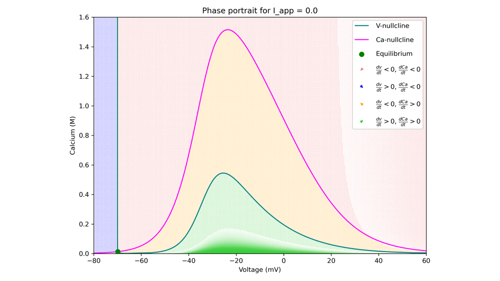

# matneur
 Projects for Mathematical Neuroscience VU 2025, Mastermath

 - assignment-x folders contain code, figures & report for assignments in the course
 - project contains code & report for final project in the course (reproducing a paper from the Dynamical Systems in Neuroscience Field)

## ASSIGNMENT 2: Calcium currents and Bursting

